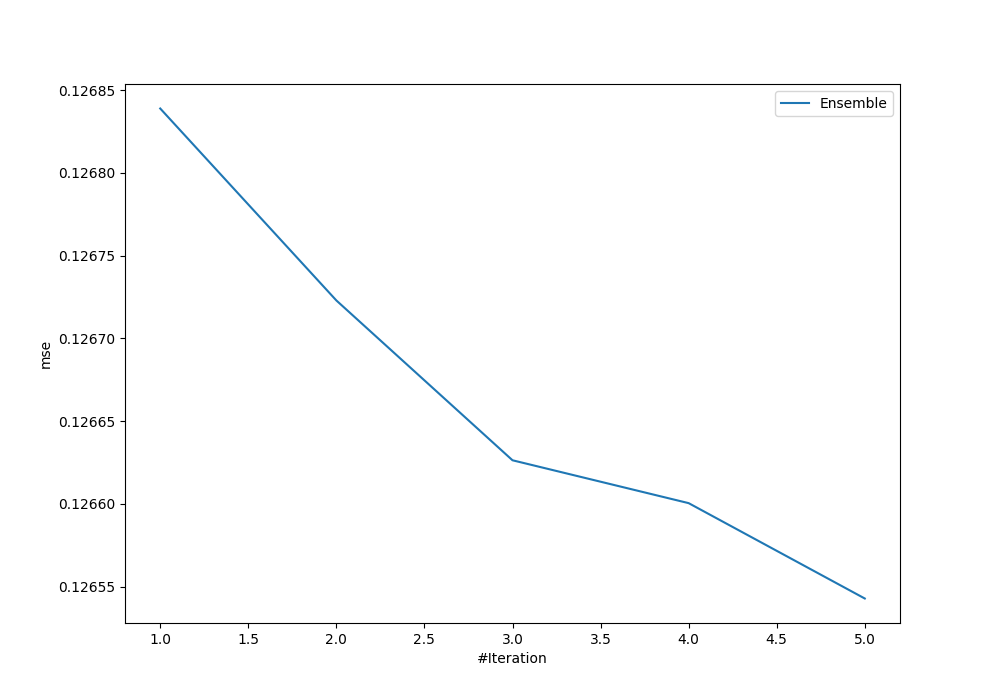
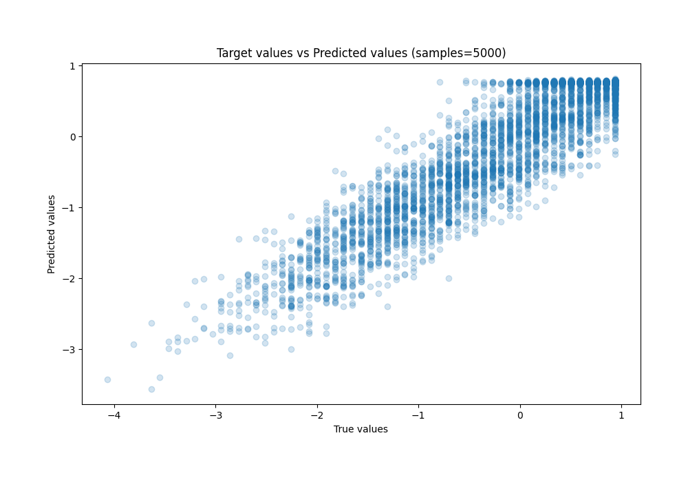
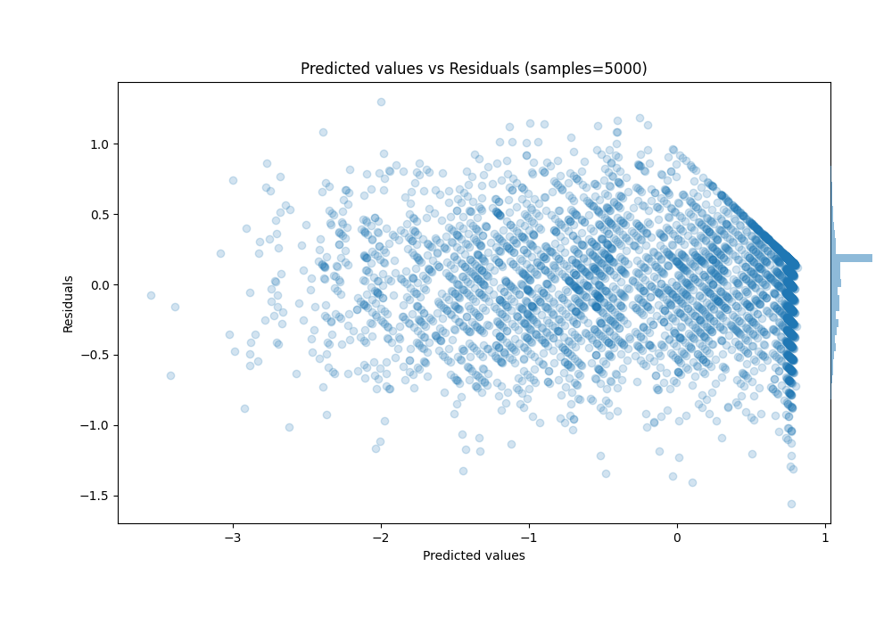

# Summary of Ensemble

[<< Go back](../README.md)

## Ensemble structure
| Model                   |   Weight |
|:------------------------|---------:|
| 3_Default_Xgboost       |        3 |
| 4_Default_NeuralNetwork |        1 |
| 5_Default_RandomForest  |        1 |

### Metric details:
| Metric   |    Score |
|:---------|---------:|
| MAE      | 0.278405 |
| MSE      | 0.126543 |
| RMSE     | 0.355729 |
| R2       | 0.875142 |
| MAPE     | 1.28462  |

## Learning curves

## True vs Predicted

## Predicted vs Residuals

[<< Go back](../README.md)
