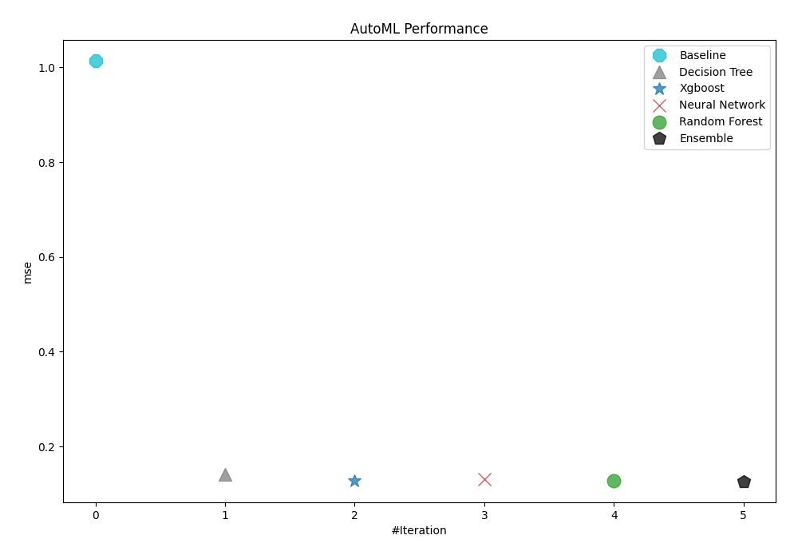

# AutoML Leaderboard

| Best model   | name                                                         | model_type     | metric_type   |   metric_value |   train_time |
|:-------------|:-------------------------------------------------------------|:---------------|:--------------|---------------:|-------------:|
|              | [1_Baseline](1_Baseline/README.md)                           | Baseline       | mse           |       1.01361  |         2.04 |
|              | [2_DecisionTree](2_DecisionTree/README.md)                   | Decision Tree  | mse           |       0.140528 |        16.69 |
|              | [3_Default_Xgboost](3_Default_Xgboost/README.md)             | Xgboost        | mse           |       0.126839 |        17.99 |
|              | [4_Default_NeuralNetwork](4_Default_NeuralNetwork/README.md) | Neural Network | mse           |       0.131261 |         7.66 |
|              | [5_Default_RandomForest](5_Default_RandomForest/README.md)   | Random Forest  | mse           |       0.127823 |        21.52 |
| **the best** | [Ensemble](Ensemble/README.md)                               | Ensemble       | mse           |       0.126543 |         0.29 |

### AutoML Performance

### AutoML Performance Boxplot

### Features Importance

### Spearman Correlation of Models

