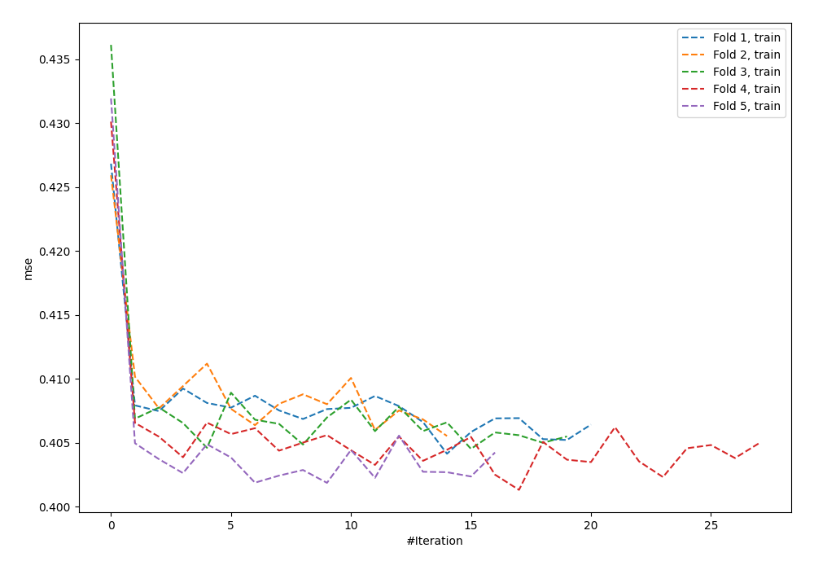
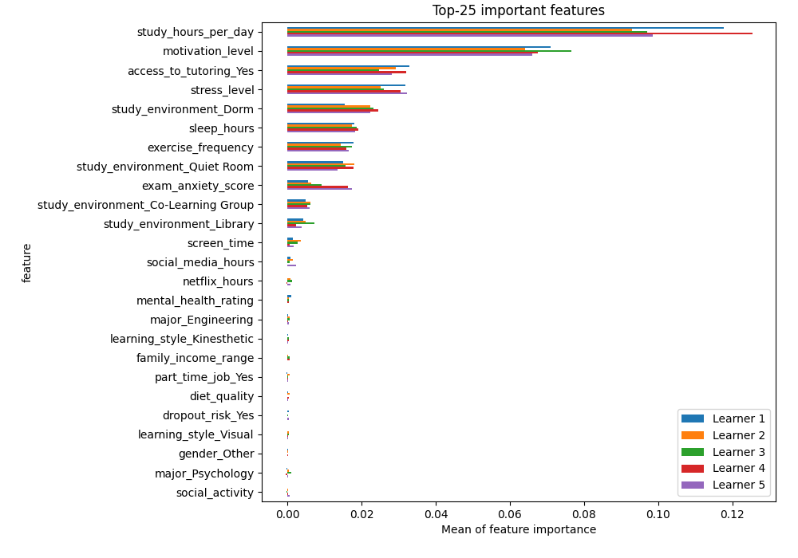
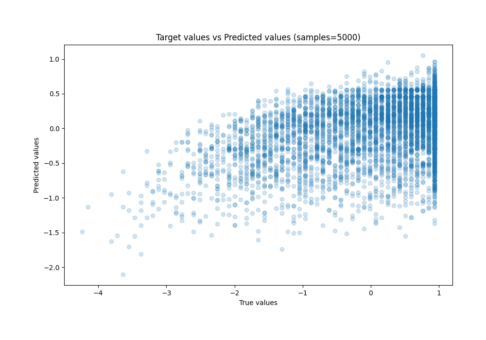
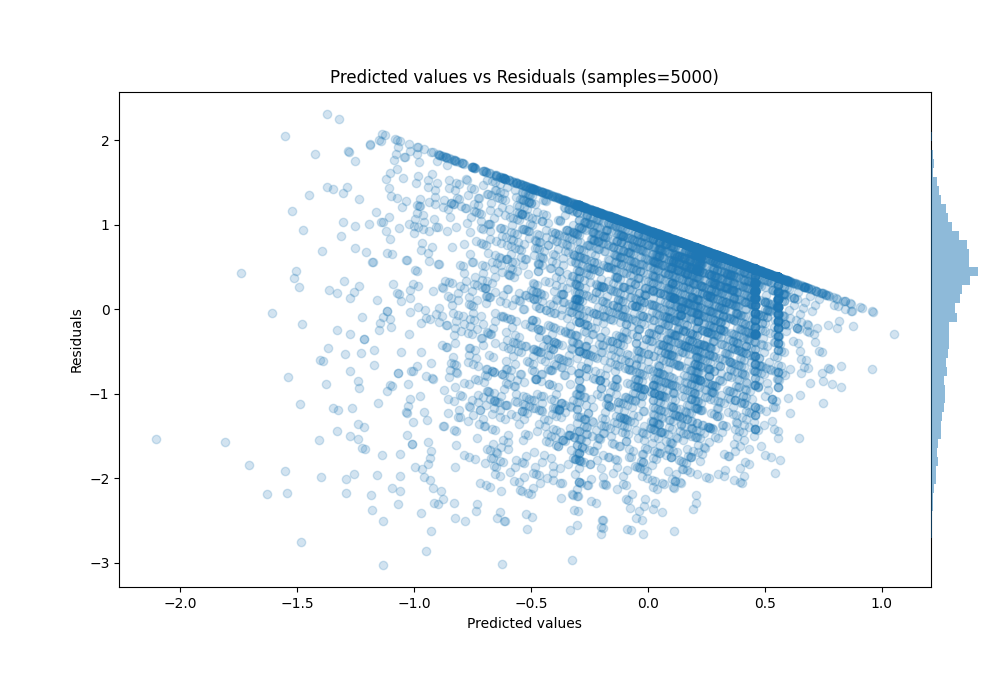

# Summary of 2_Default_NeuralNetwork

[<< Go back](../README.md)

## Neural Network
- **n_jobs**: -1
- **dense_1_size**: 32
- **dense_2_size**: 16
- **learning_rate**: 0.05
- **explain_level**: 2

## Validation
 - **validation_type**: kfold
 - **k_folds**: 5
 - **random_seed**: 42

## Optimized metric
rmse

## Training time

35.6 seconds

### Metric details:
| Metric   |    Score |
|:---------|---------:|
| MAE      | 0.738761 |
| MSE      | 0.809137 |
| RMSE     | 0.89952  |
| R2       | 0.189308 |
| MAPE     | 1.70001  |

## Learning curves

## Permutation-based Importance

## True vs Predicted

## Predicted vs Residuals

[<< Go back](../README.md)
