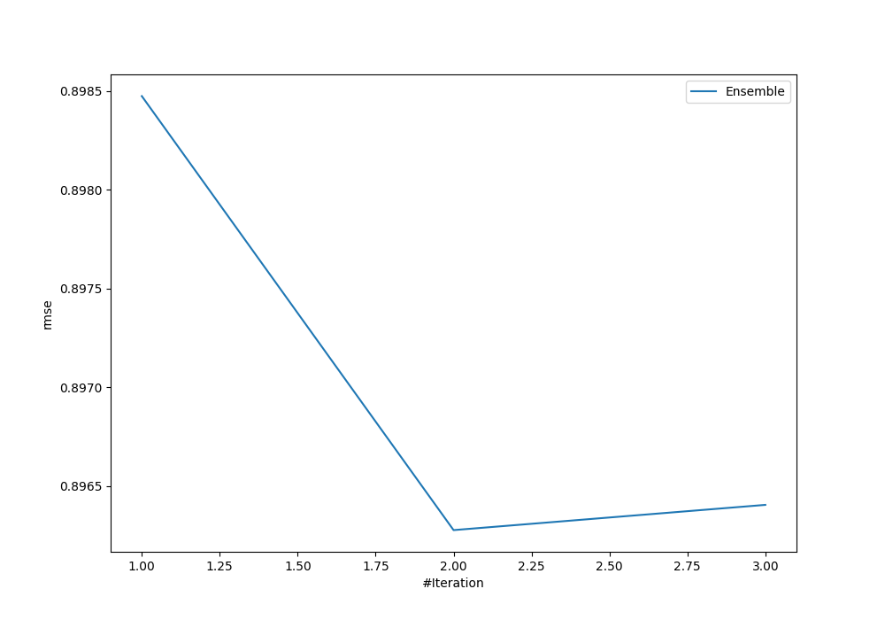
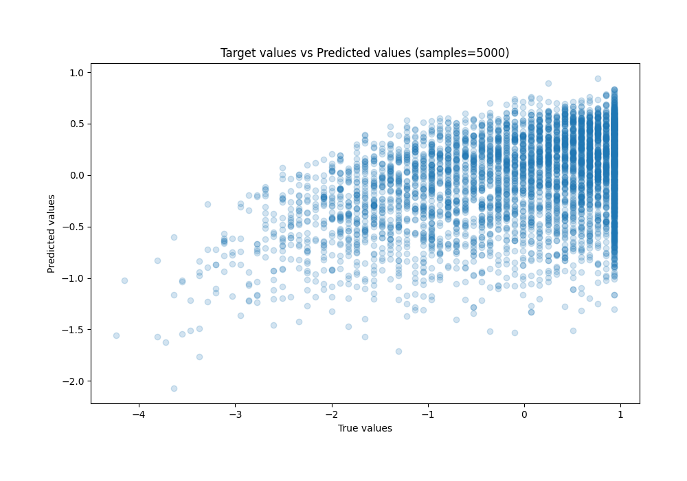
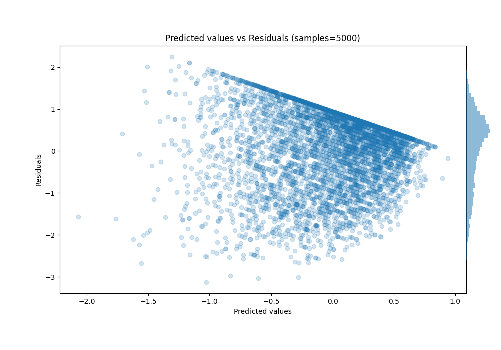

# Summary of Ensemble

[<< Go back](../README.md)

## Ensemble structure
| Model                   |   Weight |
|:------------------------|---------:|
| 1_Default_Xgboost       |        1 |
| 2_Default_NeuralNetwork |        1 |

### Metric details:
| Metric   |    Score |
|:---------|---------:|
| MAE      | 0.735451 |
| MSE      | 0.803314 |
| RMSE     | 0.896278 |
| R2       | 0.195143 |
| MAPE     | 1.67161  |

## Learning curves

## True vs Predicted

## Predicted vs Residuals

[<< Go back](../README.md)
