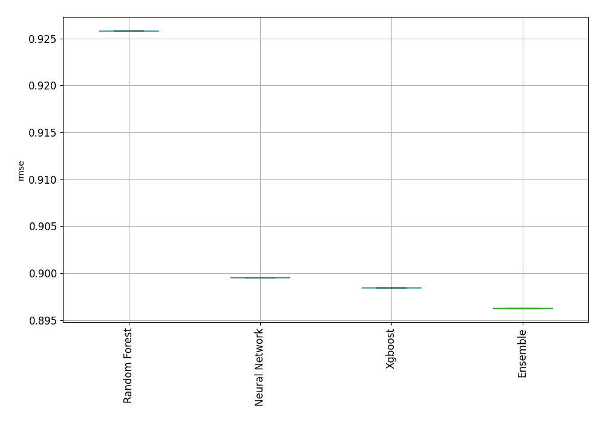

# AutoML Leaderboard

| Best model   | name                                                         | model_type     | metric_type   |   metric_value |   train_time |
|:-------------|:-------------------------------------------------------------|:---------------|:--------------|---------------:|-------------:|
|              | [1_Default_Xgboost](1_Default_Xgboost/README.md)             | Xgboost        | rmse          |       0.898474 |        84.01 |
|              | [2_Default_NeuralNetwork](2_Default_NeuralNetwork/README.md) | Neural Network | rmse          |       0.89952  |        36.95 |
|              | [3_Default_RandomForest](3_Default_RandomForest/README.md)   | Random Forest  | rmse          |       0.925824 |       177.05 |
| **the best** | [Ensemble](Ensemble/README.md)                               | Ensemble       | rmse          |       0.896278 |         0.28 |

### AutoML Performance

### AutoML Performance Boxplot

### Features Importance

### Spearman Correlation of Models

