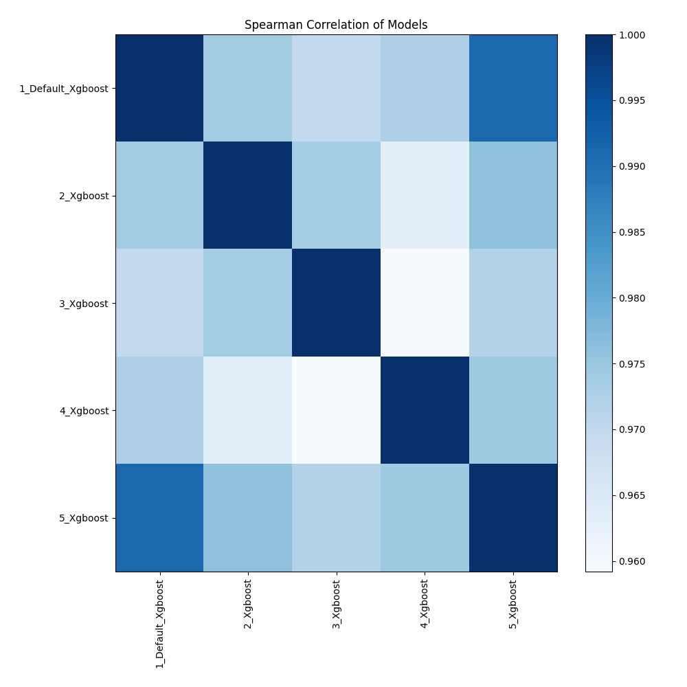

# AutoML Leaderboard

| Best model   | name                                             | model_type   | metric_type   |   metric_value |   train_time |   single_prediction_time |
|:-------------|:-------------------------------------------------|:-------------|:--------------|---------------:|-------------:|-------------------------:|
| **the best** | [1_Default_Xgboost](1_Default_Xgboost/README.md) | Xgboost      | mae           |       0.734783 |       109.12 |                   0.0459 |
|              | [2_Xgboost](2_Xgboost/README.md)                 | Xgboost      | mae           |       0.737435 |       119.04 |                   0.046  |
|              | [3_Xgboost](3_Xgboost/README.md)                 | Xgboost      | mae           |       0.737684 |       104.31 |                   0.0473 |
|              | [4_Xgboost](4_Xgboost/README.md)                 | Xgboost      | mae           |       0.735952 |        90.18 |                   0.0719 |
|              | [5_Xgboost](5_Xgboost/README.md)                 | Xgboost      | mae           |       0.735114 |       117.94 |                   0.053  |

### AutoML Performance

### AutoML Performance Boxplot

### Features Importance

### Spearman Correlation of Models

