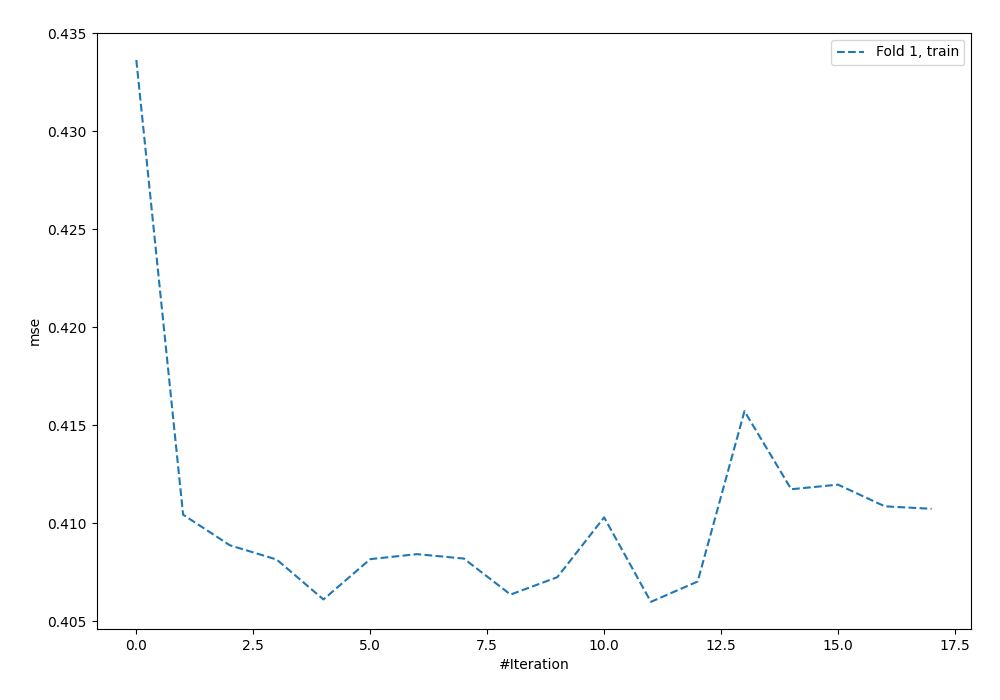

# Summary of 3_Default_NeuralNetwork_KMeansFeatures_SelectedFeatures

[<< Go back](../README.md)

## Neural Network
- **n_jobs**: -1
- **dense_1_size**: 32
- **dense_2_size**: 16
- **learning_rate**: 0.05
- **explain_level**: 2

## Validation
 - **validation_type**: split
 - **train_ratio**: 0.9
 - **shuffle**: True

## Optimized metric
mae

## Training time

9.8 seconds

### Metric details:
| Metric   |    Score |
|:---------|---------:|
| MAE      | 0.733299 |
| MSE      | 0.825804 |
| RMSE     | 0.908738 |
| R2       | 0.192488 |
| MAPE     | 1.77872  |

## Learning curves

## Permutation-based Importance

## True vs Predicted

## Predicted vs Residuals

[<< Go back](../README.md)
