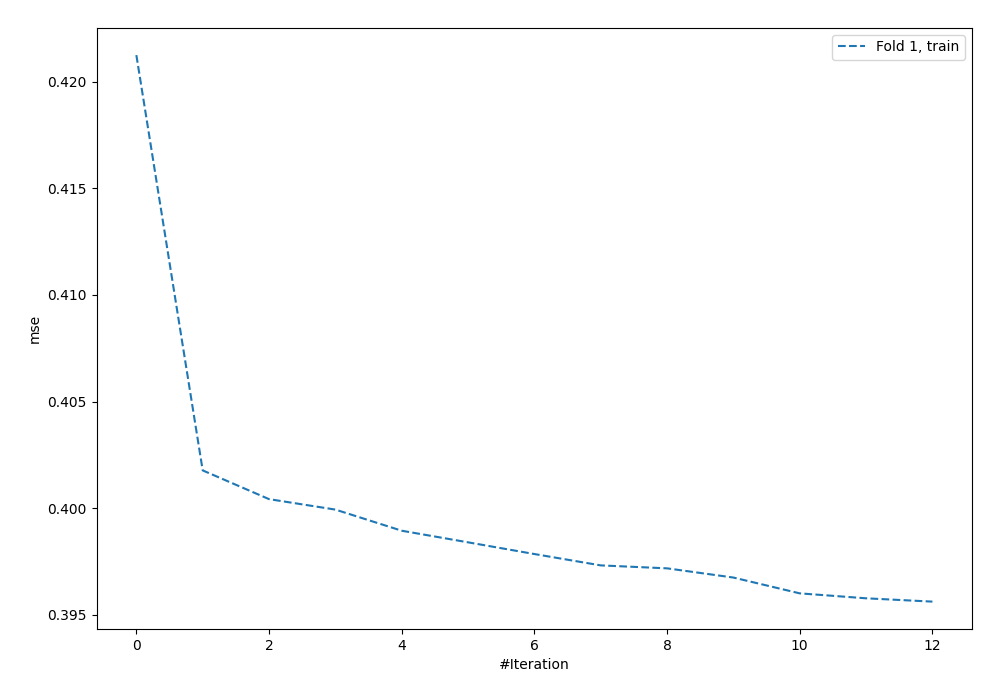
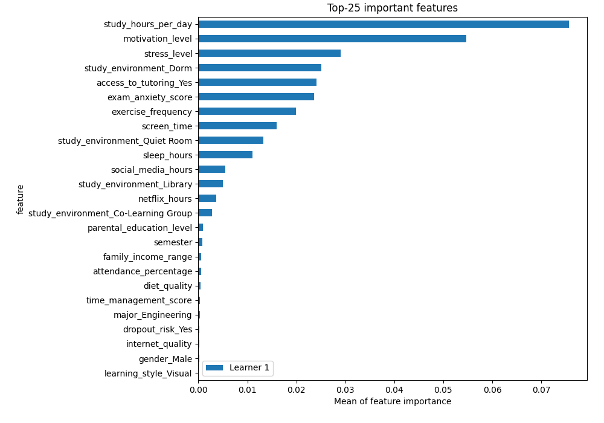
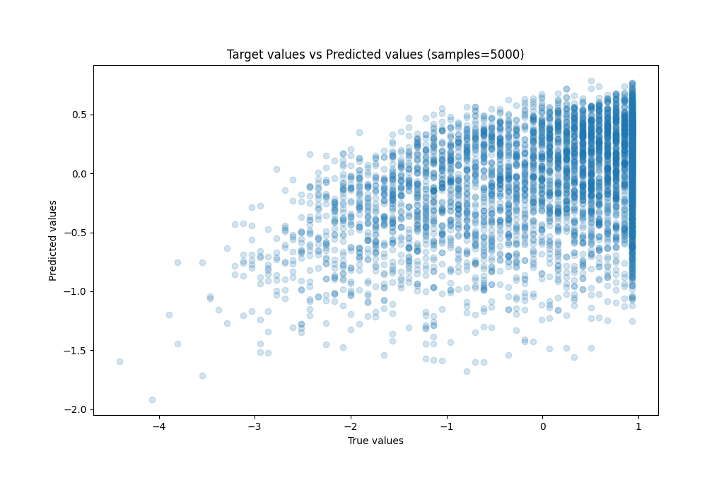
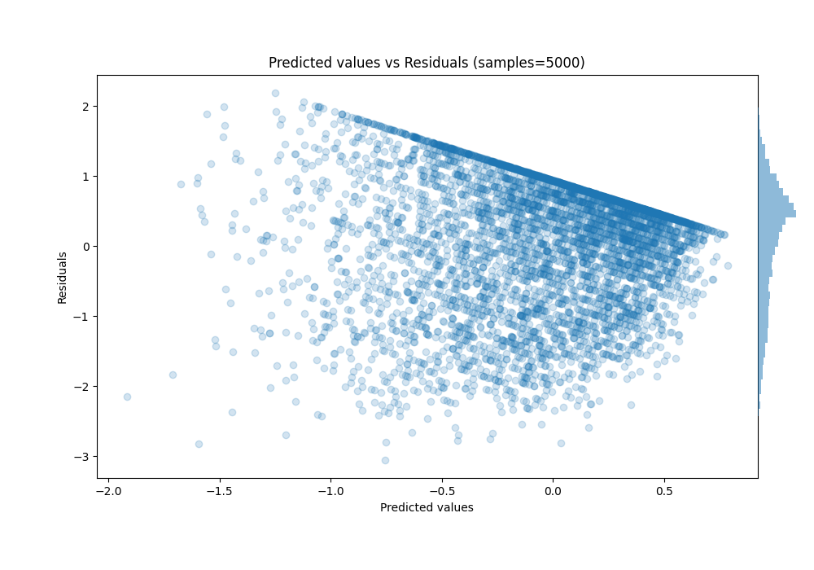

# Summary of 42_NeuralNetwork

[<< Go back](../README.md)

## Neural Network
- **n_jobs**: -1
- **dense_1_size**: 16
- **dense_2_size**: 8
- **learning_rate**: 0.01
- **explain_level**: 2

## Validation
 - **validation_type**: split
 - **train_ratio**: 0.9
 - **shuffle**: True

## Optimized metric
mae

## Training time

5.9 seconds

### Metric details:
| Metric   |    Score |
|:---------|---------:|
| MAE      | 0.74704  |
| MSE      | 0.820184 |
| RMSE     | 0.90564  |
| R2       | 0.197984 |
| MAPE     | 1.62825  |

## Learning curves

## Permutation-based Importance

## True vs Predicted

## Predicted vs Residuals

[<< Go back](../README.md)
