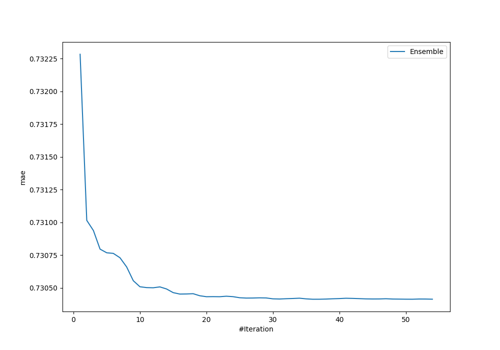
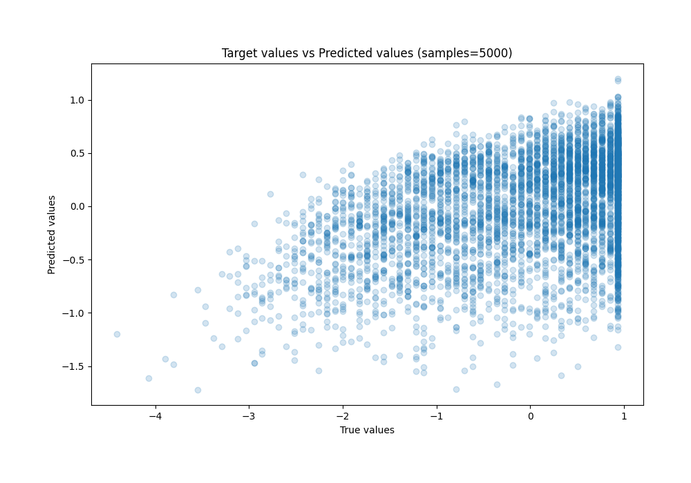
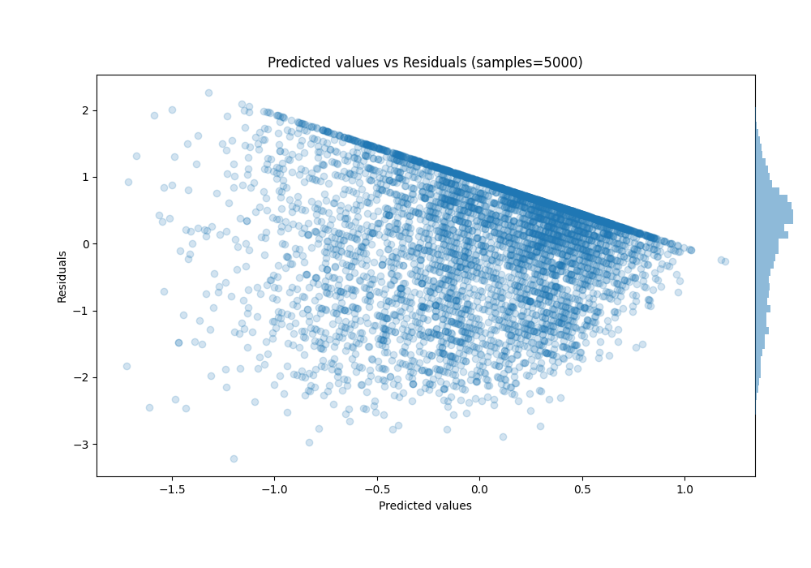

# Summary of Ensemble

[<< Go back](../README.md)

## Ensemble structure
| Model                                                   |   Weight |
|:--------------------------------------------------------|---------:|
| 25_NeuralNetwork                                        |        5 |
| 29_NeuralNetwork                                        |        2 |
| 30_NeuralNetwork                                        |        6 |
| 32_NeuralNetwork                                        |        1 |
| 3_Default_NeuralNetwork_KMeansFeatures                  |       17 |
| 3_Default_NeuralNetwork_KMeansFeatures_SelectedFeatures |        4 |
| 40_NeuralNetwork                                        |        1 |

### Metric details:
| Metric   |    Score |
|:---------|---------:|
| MAE      | 0.730413 |
| MSE      | 0.818738 |
| RMSE     | 0.904841 |
| R2       | 0.199398 |
| MAPE     | 1.71453  |

## Learning curves

## True vs Predicted

## Predicted vs Residuals

[<< Go back](../README.md)
