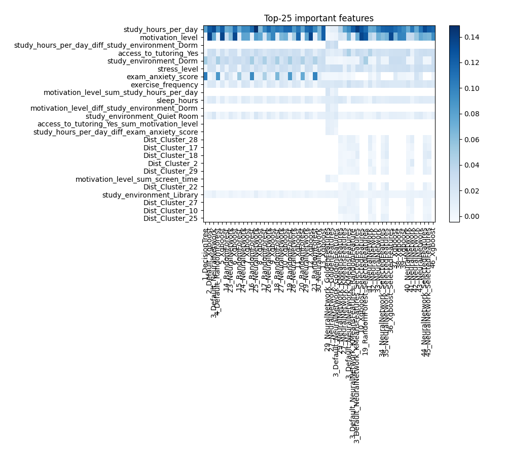

# AutoML Leaderboard

| Best model   | name                                                                                                                         | model_type     | metric_type   |   metric_value |   train_time |
|:-------------|:-----------------------------------------------------------------------------------------------------------------------------|:---------------|:--------------|---------------:|-------------:|
|              | [1_DecisionTree](1_DecisionTree/README.md)                                                                                   | Decision Tree  | mae           |       0.775967 |        18.36 |
|              | [2_Default_Xgboost](2_Default_Xgboost/README.md)                                                                             | Xgboost        | mae           |       0.739853 |        15.9  |
|              | [3_Default_NeuralNetwork](3_Default_NeuralNetwork/README.md)                                                                 | Neural Network | mae           |       0.735845 |         9.01 |
|              | [4_Default_RandomForest](4_Default_RandomForest/README.md)                                                                   | Random Forest  | mae           |       0.764073 |        25.09 |
|              | [5_Xgboost](5_Xgboost/README.md)                                                                                             | Xgboost        | mae           |       0.742428 |        20.77 |
|              | [14_RandomForest](14_RandomForest/README.md)                                                                                 | Random Forest  | mae           |       0.766006 |        34.96 |
|              | [23_NeuralNetwork](23_NeuralNetwork/README.md)                                                                               | Neural Network | mae           |       0.746786 |         5.63 |
|              | [6_Xgboost](6_Xgboost/README.md)                                                                                             | Xgboost        | mae           |       0.743129 |        18.97 |
|              | [15_RandomForest](15_RandomForest/README.md)                                                                                 | Random Forest  | mae           |       0.774187 |        20.63 |
|              | [24_NeuralNetwork](24_NeuralNetwork/README.md)                                                                               | Neural Network | mae           |       0.7423   |        10.36 |
|              | [7_Xgboost](7_Xgboost/README.md)                                                                                             | Xgboost        | mae           |       0.740665 |        16.11 |
|              | [16_RandomForest](16_RandomForest/README.md)                                                                                 | Random Forest  | mae           |       0.751559 |        35.27 |
|              | [25_NeuralNetwork](25_NeuralNetwork/README.md)                                                                               | Neural Network | mae           |       0.738366 |        13.58 |
|              | [8_Xgboost](8_Xgboost/README.md)                                                                                             | Xgboost        | mae           |       0.744407 |        14.78 |
|              | [17_RandomForest](17_RandomForest/README.md)                                                                                 | Random Forest  | mae           |       0.752945 |        25.65 |
|              | [26_NeuralNetwork](26_NeuralNetwork/README.md)                                                                               | Neural Network | mae           |       0.746317 |        11.05 |
|              | [9_Xgboost](9_Xgboost/README.md)                                                                                             | Xgboost        | mae           |       0.738622 |        12.99 |
|              | [18_RandomForest](18_RandomForest/README.md)                                                                                 | Random Forest  | mae           |       0.748434 |        33.61 |
|              | [27_NeuralNetwork](27_NeuralNetwork/README.md)                                                                               | Neural Network | mae           |       0.734409 |        10.63 |
|              | [10_Xgboost](10_Xgboost/README.md)                                                                                           | Xgboost        | mae           |       0.737874 |        11.53 |
|              | [19_RandomForest](19_RandomForest/README.md)                                                                                 | Random Forest  | mae           |       0.748217 |        33.98 |
|              | [28_NeuralNetwork](28_NeuralNetwork/README.md)                                                                               | Neural Network | mae           |       0.746649 |         8.36 |
|              | [11_Xgboost](11_Xgboost/README.md)                                                                                           | Xgboost        | mae           |       0.742348 |        33.84 |
|              | [20_RandomForest](20_RandomForest/README.md)                                                                                 | Random Forest  | mae           |       0.765348 |        21.66 |
|              | [29_NeuralNetwork](29_NeuralNetwork/README.md)                                                                               | Neural Network | mae           |       0.73315  |         7.01 |
|              | [12_Xgboost](12_Xgboost/README.md)                                                                                           | Xgboost        | mae           |       0.741023 |        15.57 |
|              | [21_RandomForest](21_RandomForest/README.md)                                                                                 | Random Forest  | mae           |       0.76507  |        17.54 |
|              | [30_NeuralNetwork](30_NeuralNetwork/README.md)                                                                               | Neural Network | mae           |       0.745952 |         9.73 |
|              | [13_Xgboost](13_Xgboost/README.md)                                                                                           | Xgboost        | mae           |       0.739711 |        27.33 |
|              | [29_NeuralNetwork_GoldenFeatures](29_NeuralNetwork_GoldenFeatures/README.md)                                                 | Neural Network | mae           |       0.737131 |        15.57 |
|              | [27_NeuralNetwork_GoldenFeatures](27_NeuralNetwork_GoldenFeatures/README.md)                                                 | Neural Network | mae           |       0.734852 |         9.75 |
|              | [3_Default_NeuralNetwork_GoldenFeatures](3_Default_NeuralNetwork_GoldenFeatures/README.md)                                   | Neural Network | mae           |       0.740754 |        12.38 |
|              | [29_NeuralNetwork_KMeansFeatures](29_NeuralNetwork_KMeansFeatures/README.md)                                                 | Neural Network | mae           |       0.735142 |         7.69 |
|              | [27_NeuralNetwork_KMeansFeatures](27_NeuralNetwork_KMeansFeatures/README.md)                                                 | Neural Network | mae           |       0.741994 |        12.9  |
|              | [3_Default_NeuralNetwork_KMeansFeatures](3_Default_NeuralNetwork_KMeansFeatures/README.md)                                   | Neural Network | mae           |       0.732283 |        11.42 |
|              | [3_Default_NeuralNetwork_KMeansFeatures_RandomFeature](3_Default_NeuralNetwork_KMeansFeatures_RandomFeature/README.md)       | Neural Network | mae           |       0.73615  |         9.02 |
|              | [3_Default_NeuralNetwork_KMeansFeatures_SelectedFeatures](3_Default_NeuralNetwork_KMeansFeatures_SelectedFeatures/README.md) | Neural Network | mae           |       0.733299 |        10.77 |
|              | [10_Xgboost_SelectedFeatures](10_Xgboost_SelectedFeatures/README.md)                                                         | Xgboost        | mae           |       0.737765 |        10.9  |
|              | [19_RandomForest_SelectedFeatures](19_RandomForest_SelectedFeatures/README.md)                                               | Random Forest  | mae           |       0.748362 |        42.92 |
|              | [31_NeuralNetwork](31_NeuralNetwork/README.md)                                                                               | Neural Network | mae           |       0.737586 |        11.09 |
|              | [32_NeuralNetwork](32_NeuralNetwork/README.md)                                                                               | Neural Network | mae           |       0.738965 |         9.21 |
|              | [33_NeuralNetwork](33_NeuralNetwork/README.md)                                                                               | Neural Network | mae           |       0.744587 |         8.8  |
|              | [34_NeuralNetwork_SelectedFeatures](34_NeuralNetwork_SelectedFeatures/README.md)                                             | Neural Network | mae           |       0.740272 |         9.64 |
|              | [35_NeuralNetwork_SelectedFeatures](35_NeuralNetwork_SelectedFeatures/README.md)                                             | Neural Network | mae           |       0.742645 |        14.32 |
|              | [36_Xgboost_SelectedFeatures](36_Xgboost_SelectedFeatures/README.md)                                                         | Xgboost        | mae           |       0.738718 |         8.41 |
|              | [37_Xgboost](37_Xgboost/README.md)                                                                                           | Xgboost        | mae           |       0.73866  |        13.67 |
|              | [38_Xgboost](38_Xgboost/README.md)                                                                                           | Xgboost        | mae           |       0.73815  |        13.91 |
|              | [39_Xgboost](39_Xgboost/README.md)                                                                                           | Xgboost        | mae           |       0.741008 |        17.6  |
|              | [40_NeuralNetwork](40_NeuralNetwork/README.md)                                                                               | Neural Network | mae           |       0.734692 |        10.22 |
|              | [41_NeuralNetwork](41_NeuralNetwork/README.md)                                                                               | Neural Network | mae           |       0.739673 |        18.54 |
|              | [42_NeuralNetwork](42_NeuralNetwork/README.md)                                                                               | Neural Network | mae           |       0.74704  |         6.84 |
|              | [43_NeuralNetwork](43_NeuralNetwork/README.md)                                                                               | Neural Network | mae           |       0.735633 |         7.3  |
|              | [44_NeuralNetwork_SelectedFeatures](44_NeuralNetwork_SelectedFeatures/README.md)                                             | Neural Network | mae           |       0.737842 |        19.07 |
|              | [45_NeuralNetwork_SelectedFeatures](45_NeuralNetwork_SelectedFeatures/README.md)                                             | Neural Network | mae           |       0.741446 |        14.75 |
|              | [46_Xgboost](46_Xgboost/README.md)                                                                                           | Xgboost        | mae           |       0.737441 |        13.93 |
| **the best** | [Ensemble](Ensemble/README.md)                                                                                               | Ensemble       | mae           |       0.730413 |         7.23 |

### AutoML Performance

### AutoML Performance Boxplot

### Features Importance

### Spearman Correlation of Models

